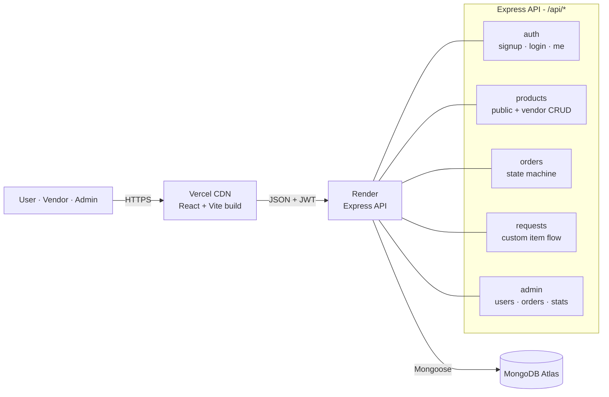

# Evently

**Event services marketplace.** Users discover and book vendors - catering, decor, photography, venues, sound & lighting - for their events. Vendors manage their catalog and incoming orders. Admins oversee the marketplace.

Full-stack MERN project built end-to-end: Mongoose data models, JWT auth with role-based guards, an explicit order state machine, and a Linear-inspired React UI.

---

## Live demo

| | URL |
|---|---|
| Web app | _Fill in after deploying to Vercel_ |
| API | _Fill in after deploying to Render_ |
| API health | `GET {API}/api/health` |

## Demo credentials

After running `npm run seed`, these accounts exist:

| Role | Email | Password |
|---|---|---|
| Admin | `admin@evently.dev` | `ChangeMe#2026` |
| Vendor - Catering | `catering@evently.dev` | `Vendor#2026` |
| Vendor - Decor | `decor@evently.dev` | `Vendor#2026` |
| Vendor - Photography | `photo@evently.dev` | `Vendor#2026` |
| User | `anita@evently.dev` | `User#2026` |
| User | `rohan@evently.dev` | `User#2026` |

> Change these in production by setting `ADMIN_EMAIL` / `ADMIN_PASSWORD` in the server env and editing the seed script for the other accounts, or by signing up fresh accounts through the UI.

---

## Tech stack

| Layer | Choice | Why |
|---|---|---|
| Frontend | React 18 + Vite | Fast dev loop, minimal config, modern tooling |
| Routing | React Router v6 | Standard; `ProtectedRoute` wrapper stays simple |
| Styling | Tailwind CSS | Design tokens in one place, no runtime CSS-in-JS cost |
| Forms | React Hook Form + Zod | Schema-level validation matching the backend |
| HTTP | Axios | Interceptors centralize JWT attach + 401 redirect |
| Backend | Node + Express | Unopinionated, fits the scope without ceremony |
| ODM | Mongoose 8 | Schema validation, hooks, populate |
| Auth | JWT + bcryptjs | Stateless auth; `requireAuth` + `requireRole(...)` chain |
| Security | helmet, express-rate-limit, CORS | Baseline hardening on auth routes |
| Validation | express-validator | Consistent `{ error, fields }` shape on all 400s |
| Database | MongoDB Atlas | Free tier, cloud-hosted |
| Deploy | Vercel · Render · Atlas | Free tiers, zero-config deploy |

### Things worth pointing out in an interview

- **Order status as an explicit state machine** (`server/src/lib/orderState.js`) - a pure module that owns all transition logic. Route handlers ask `canTransition(from, to)` and return 400 on invalid jumps.
- **Password hash never leaves the database** - stripped in `User.toJSON`'s transform, not per-route. Impossible to leak even by accident.
- **Server-side price enforcement** - when a user places an order, the server ignores client-sent prices and re-reads them from `Product` before computing the total.
- **Cross-vendor orders rejected** - one order = one vendor, enforced server-side via a `Set` check on product vendors.
- **Auth failure is centralized** - one Axios response interceptor catches any 401 from any request, triggers `AuthContext.logout()`, and redirects to `/login`.
- **All data screens have three explicit branches** - loading, error, empty - not just a spinner.

---

## Architecture



### Order state machine

```
         ┌────────────┐
         │  placed    │  ← new orders start here
         └──┬─────┬───┘
       ┌────┘     └────┐
       ▼               ▼
 ┌──────────┐    ┌──────────┐
 │ accepted │    │ rejected │  ← terminal
 └──┬────┬──┘    └──────────┘
    │    └──────────────┐
    ▼                   ▼
┌──────────────────┐  ┌──────────┐
│ out_for_delivery │  │ rejected │
└────┬─────────────┘  └──────────┘
     ▼
 ┌───────────┐
 │ delivered │  ← terminal
 └───────────┘
```

---

## Local setup

```bash
# 1. Clone & install
git clone https://github.com/<you>/evently.git
cd evently
npm run install:all                       # installs server + client deps

# 2. Create env files
cp server/.env.example server/.env
cp client/.env.example client/.env

# 3. Fill in server/.env - at minimum MONGO_URI and JWT_SECRET
#    Quick JWT_SECRET: node -e "console.log(require('crypto').randomBytes(64).toString('hex'))"

# 4. Seed the database (wipes and recreates demo data)
npm run seed

# 5. Run
npm run dev:server    # terminal 1 → http://localhost:5000
npm run dev:client    # terminal 2 → http://localhost:5173
```

---

## Deployment - one-time setup

### 1 · MongoDB Atlas (~5 min)

1. Create a free M0 cluster at [cloud.mongodb.com](https://cloud.mongodb.com).
2. **Database Access** → add a user (username + password, "read and write to any database").
3. **Network Access** → add IP `0.0.0.0/0` (required for Render; narrow later if you want).
4. **Connect** → "Drivers" → copy the connection string. Replace `<password>` with your DB user password and insert `/evently` before the `?`.
5. Keep this string for the Render step.

### 2 · Render - backend (~5 min)

1. Push this repo to GitHub.
2. [Render](https://render.com) → **New → Blueprint** → point at your repo. Render reads `render.yaml` and pre-configures the service.
3. Fill in the `sync: false` variables in the dashboard:
   - `MONGO_URI` - Atlas connection string from step 1
   - `CLIENT_ORIGIN` - leave blank for now; fill in after Vercel deploys
   - `ADMIN_EMAIL`, `ADMIN_PASSWORD`, `ADMIN_NAME` - your admin credentials
4. Deploy. Wait until logs show `→ evently api listening on :10000`.
5. Hit `https://<your-service>.onrender.com/api/health` - should return `{ ok: true, ... }`.
6. **Seed the DB once:** Render → your service → Shell → `npm run seed`.

### 3 · Vercel - frontend (~3 min)

1. [Vercel](https://vercel.com) → **Add New → Project** → import the same repo.
2. Framework preset: leave as **Other** (`vercel.json` handles it).
3. Environment variable: `VITE_API_BASE_URL` = `https://<your-render-service>.onrender.com`
4. Deploy. Copy the resulting `*.vercel.app` URL.

### 4 · Wire CORS

1. Back on Render → your service → Environment → set `CLIENT_ORIGIN` to the Vercel URL (no trailing slash).
2. Render auto-redeploys. Done.

### 5 · Smoke test (30 sec)

1. Open the Vercel URL → sign in with `anita@evently.dev` / `User#2026`.
2. Add a product to cart → checkout → verify success page shows.
3. Log out, sign in with `catering@evently.dev` / `Vendor#2026` → verify the incoming order is visible and status buttons work.
4. Log in as `admin@evently.dev` / `ChangeMe#2026` → stats page should show non-zero counts.

### Notes & gotchas

- **Render free tier cold-starts** after ~15 min of inactivity; first request takes 30–50 sec. Fine for a portfolio demo - mention it rather than hide it.
- **JWT_SECRET** is auto-generated by `render.yaml`'s `generateValue: true`.
- **Atlas IP whitelist**: if you narrow from `0.0.0.0/0` later, allow Render's outbound IPs.

---

## Project structure

```
evently/
├── client/                          React + Vite
│   └── src/
│       ├── api/client.js            Axios instance + interceptors
│       ├── context/                 AuthContext, ToastContext
│       ├── components/              Navbar, ProtectedRoute, shared UI
│       ├── lib/                     cart.js, schemas.js, format.js
│       ├── pages/auth/              Login, Signup, Unauthorized
│       ├── pages/user/              Browse, ProductDetail, Cart, Checkout, Success, MyOrders, OrderDetail, RequestItem
│       ├── pages/vendor/            Dashboard, Products, ProductForm, Orders, Requests
│       ├── pages/admin/             Overview, UsersList, Orders
│       └── App.jsx                  Routes + guards
├── server/                          Express API
│   └── src/
│       ├── config/db.js             Mongoose connect/disconnect
│       ├── lib/orderState.js        Pure state machine
│       ├── middleware/              requireAuth, requireRole, handleValidation, errorHandler
│       ├── models/                  User, Product, Order, Request
│       ├── routes/                  auth, products, orders, requests, vendors, admin
│       ├── scripts/seed.js          Demo data bootstrap
│       └── index.js                 Entry point, graceful shutdown
├── render.yaml                      Backend deploy config
├── vercel.json                      Frontend deploy config
└── README.md
```

---

## API reference

| Method | Path | Role | Purpose |
|---|---|---|---|
| GET | `/api/health` | public | Health check for Render / uptime monitors |
| POST | `/api/auth/signup` | public | Create user or vendor account |
| POST | `/api/auth/login` | public | Returns `{ token, user }` |
| GET | `/api/auth/me` | any | Current user from JWT |
| GET | `/api/products` | public | List with `?vendor=`, `?category=`, `?q=`, `?page=`, `?limit=` |
| GET | `/api/products/:id` | public | Product detail |
| GET | `/api/products/mine/list` | vendor | Vendor's own products |
| POST | `/api/products` | vendor | Create |
| PUT | `/api/products/:id` | vendor (owner) | Update |
| DELETE | `/api/products/:id` | vendor (owner) | Delete |
| POST | `/api/orders` | user | Place an order |
| GET | `/api/orders/mine` | user | User's own orders |
| GET | `/api/orders/incoming` | vendor | Vendor's incoming orders |
| GET | `/api/orders/:id` | user/vendor/admin | Detail (access-controlled) |
| PUT | `/api/orders/:id/status` | vendor (owner) | State machine transition |
| GET | `/api/vendors` | public | Active vendors, for the Request Item dropdown |
| POST | `/api/requests` | user | Create a custom request |
| GET | `/api/requests/mine` | user | User's own requests |
| GET | `/api/requests/incoming` | vendor | Vendor's incoming requests |
| PUT | `/api/requests/:id/respond` | vendor (owner) | Accept / reject with message |
| GET | `/api/admin/stats` | admin | Marketplace KPIs |
| GET | `/api/admin/users` | admin | `?role=user\|vendor\|admin` |
| PUT | `/api/admin/users/:id/active` | admin | Toggle active |
| GET | `/api/admin/orders` | admin | `?status=<state>` |

All 4xx errors use the shape `{ error: string, fields?: Record<string, string> }`.

---

## Author

**Vedang Sai Rath** - B.Tech ECE · Guru Tegh Bahadur Institute of Technology (IPU) · 2026

[LinkedIn](#) · [GitHub](#) · `vedang@example.com`
